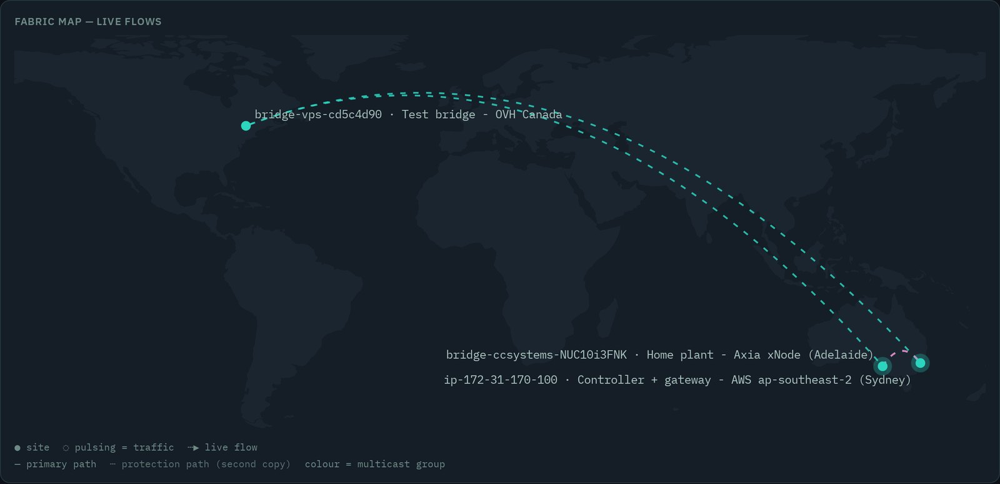
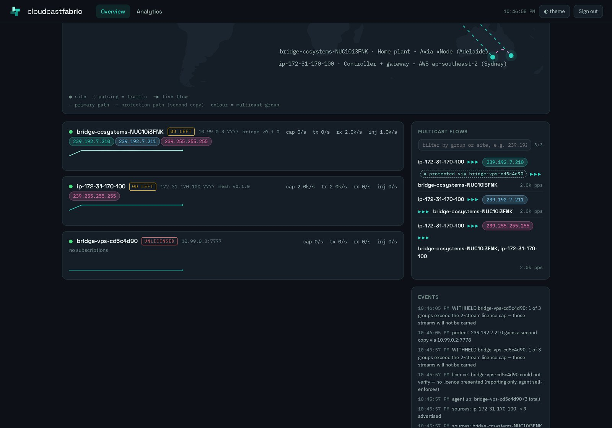
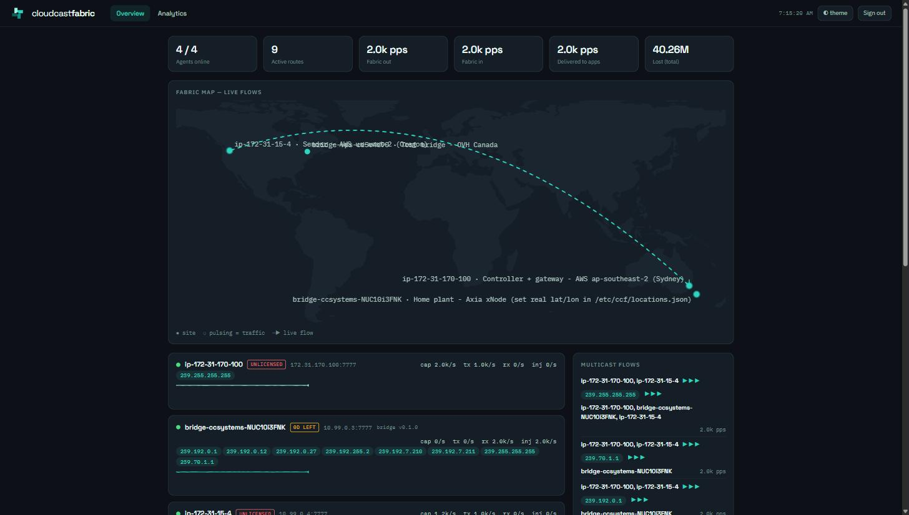
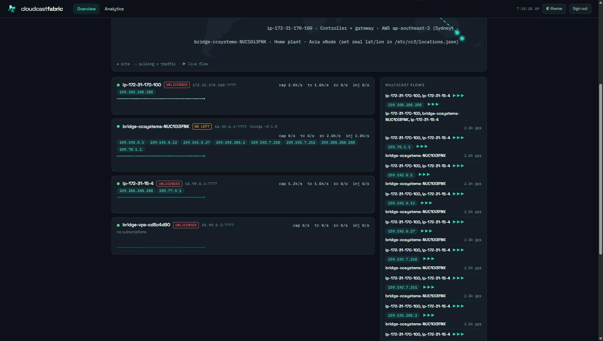
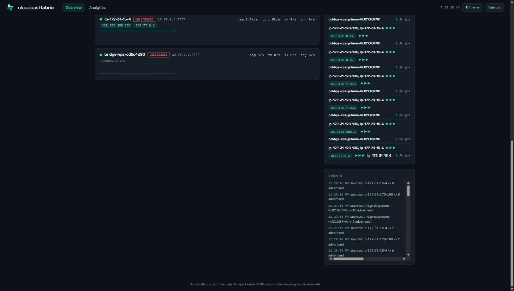
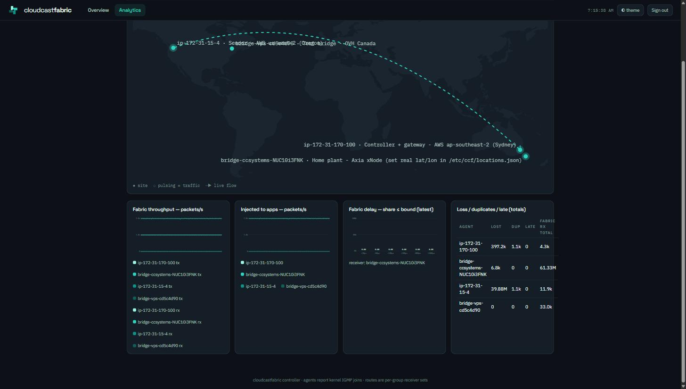
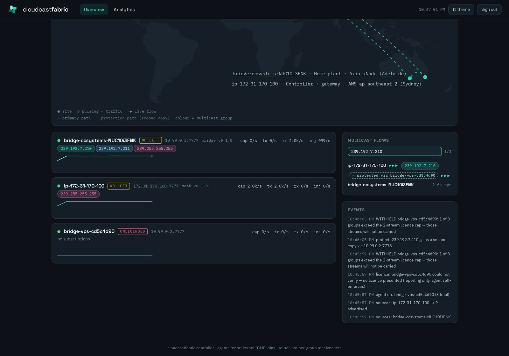
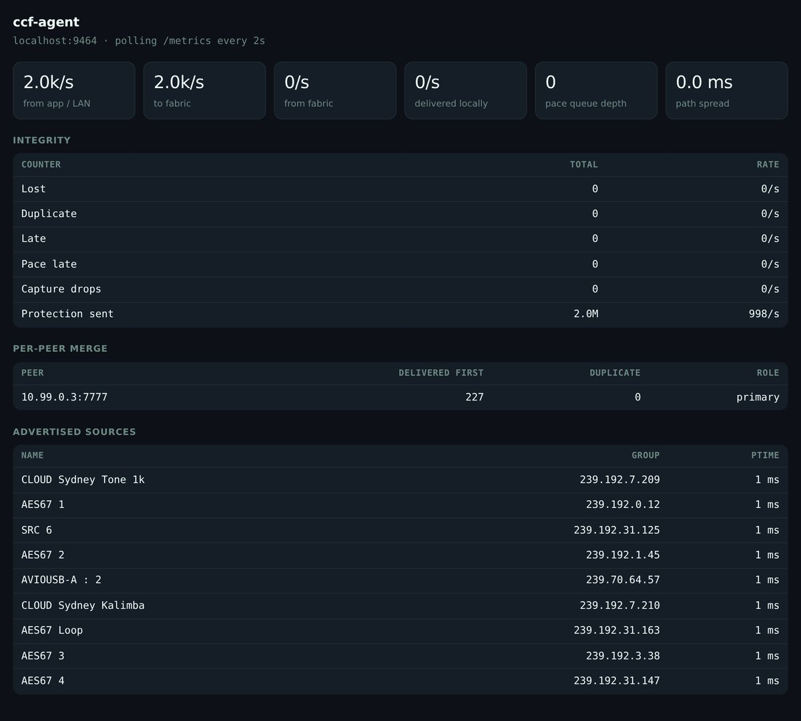

# CloudcastFabric manual

**CloudcastFabric** carries real IP multicast between machines that have no
multicast network — cloud instances, and on-prem plants reached over a VPN.
An agent runs on every participating host; applications send to and join
ordinary multicast groups on a virtual interface, and the fabric moves the
packets between hosts as unicast UDP. Nothing in the application changes: it
binds a group, it joins with `IP_ADD_MEMBERSHIP`, and the kernel delivers real
multicast frames at the far end.

It is built for professional audio-over-IP — AES67 and Livewire — so two
things matter more than throughput:

- **The jitter tail.** The data plane is Rust with pinned real-time threads,
  batched `recvmmsg`/`sendmmsg` and pre-allocated buffers. Measured fabric hop
  delay is p50 17 µs, 100 % under 500 µs at every load tested.
- **Clocking.** Every cloud host runs its own PTP grandmaster fed from the AWS
  Nitro PHC; a bridge instead slaves to the plant's existing grandmaster and
  paces its LAN egress on plant time. **PTP is never tunnelled through the
  fabric** — it is deliberately dropped at the encapsulation point. Receivers
  lock to a local master serving the same traceable time as every other host's.

This manual describes the system as it ships today: agent mesh, router and
bridge modes, the controller and its web dashboard, the metrics surface, the
timing stack, and the deployment conditions that must be met for any of it to
work.

---

## Contents

1. [Core concepts](#1-core-concepts)
2. [Architecture](#2-architecture)
   - [The data plane](#the-data-plane) · [The control plane](#the-control-plane) · [The encapsulation header](#the-encapsulation-header) · [Timing](#timing-per-host-grandmasters) · [Modes at a glance](#modes-at-a-glance)
3. [Deployment requirements](#3-deployment-requirements)
   - [Instances and the PHC](#instances-and-the-phc) · [Kernel and interface settings](#kernel-and-interface-settings) · [MTU](#mtu) · [Ports and security groups](#ports-and-security-groups)
4. [Installation](#4-installation)
   - [Building](#41-building) · [Cloud agent (mesh)](#42-cloud-agent-mesh-mode) · [Controller](#43-controller) · [PTP grandmaster](#44-ptp-grandmaster) · [Router](#45-router-optional) · [Ground-to-cloud bridge](#46-ground-to-cloud-bridge) · [Egress pacing and the clock](#47-egress-pacing-and-the-clock-behind-it) · [Dual-path protection](#48-dual-path-protection) · [Codecs](#49-codecs-on-the-wan-leg)
5. [Configuration reference](#5-configuration-reference)
   - [Agent flags](#51-agent-command-line-flags) · [Agent environment file](#52-agent-environment-file) · [Controller environment](#53-controller-environment-variables) · [ptp-gm.conf](#54-ptp-gmconf) · [systemd units](#55-systemd-units)
6. [Operations](#6-operations)
   - [The dashboard](#61-the-dashboard) · [HTTP surface](#62-http-surface) · [Metrics](#63-metrics) · [Agent status page](#64-agent-status-page) · [Adding an agent](#65-adding-an-agent) · [Bridging a site](#66-bridging-a-site) · [Verifying a path](#67-verifying-a-path-with-ccf-spike) · [Checking the clock](#68-checking-the-clock) · [Discovery: SAP](#69-discovery-sap-announcements) · [Address collisions](#610-multicast-address-collisions)
7. [Troubleshooting](#7-troubleshooting)
8. [Scope and platform support](#8-scope-and-platform-support)

---

## 1. Core concepts

**The virtual interface is the product.** Each mesh agent creates `ccf0`, a
**TAP** (layer-2) device with a fabric address, and installs a route for
`224.0.0.0/4` into it. Applications bind their sends and joins to that
interface and behave exactly as they would on a multicast LAN. `ccf0` is a TAP
rather than a TUN for a specific reason: a TUN has no MAC address, so every
`ptp4l` on the fabric derived the same clock identity
(`000000.fffe.000000`) and clients rejected each other's announces as their
own. A real per-host MAC also keeps ARP and discovery traffic working for AoIP
applications.

**Subscriptions come from the kernel, not from config.** The agent reads
`/proc/net/igmp` for `ccf0` every loop — whatever local applications have
actually joined — and reports that set to the controller. Two group ranges are
never reported: link-local `224.0.0.0/24`, and the PTP group `224.0.1.129`.

**Routes are receiver sets.** The controller answers with, per group, the
list of agents that have subscribers, minus the recipient itself. A sender
transmits a group only while somebody wants it; with no subscribers the TX
pump drops the frame **and does not advance the sequence number**, so a
receiver joining later does not count the idle stretch as loss.

**Delivery is de-duplicated and reordered per source.** Every received fabric
packet passes through a 1024-slot sliding window keyed by the sending agent's
address: a packet is *Accept* (new, injected), *Dup* (already seen) or *Late*
(older than the window). It is also what the integrity counters on the dashboard and in
§6.3 are derived from.

**PTP never crosses the fabric.** UDP 319 and 320 are dropped by both the mesh
TX pump and the bridge LAN pump unless `--forward-ptp` is given. Tunnelled PTP
would fight the local grandmasters through BMCA and carry fabric jitter into
clock servos; instead every host serves identical, independently-sourced GPS
time. Do not "fix" this.

## 2. Architecture

```
                    ┌──────────────────────────────┐
                    │  Controller (.NET 8)          │
                    │  NDJSON :8600 · web :8601/:8443│
                    └───────▲──────────────▲────────┘
      hello / subs (TCP)    │              │   routes push
                            │              │
   ┌──────────┐   fabric UDP 7777    ┌──────┴───┐        ┌───────────┐
   │ Agent A  │◀────────────────────▶│ Agent B  │        │  Bridge   │
   │ TAP ccf0 │      (mesh: direct)  │ TAP ccf0 │        │ AF_PACKET │
   │ local GM │                      │ local GM │        │  on eth   │
   └────▲─────┘                      └────▲─────┘        └─────▲─────┘
        │ app sends/joins 239.x.x.x       │                    │ real plant LAN
        │ on ccf0, locks PTP locally      │                    │ multicast + IGMP
```

### The data plane

`ccf-agent` is one Rust binary with three modes, and two pinned threads on the
packet path in each of them.

**Mesh** (`--mode mesh`) is what runs on a participating instance. The TX pump
reads Ethernet frames from `ccf0`, keeps only IPv4 multicast UDP, prepends the
20-byte fabric header, and unicasts one copy per target. The RX pump receives
fabric datagrams with `recvmmsg` (batch 32, `MSG_WAITFORONE`), de-duplicates,
and writes the original frame back into `ccf0`, where the kernel delivers it to
every locally joined socket.

> `MSG_WAITFORONE` is not an optimisation, it is a correctness fix. A blocking
> `recvmmsg` without it waits for the *full* batch: at 1,000 pps a 32-slot
> batch silently added ~32 ms of latency (measured p50 15.3 ms — exactly half
> the batch window).

**Router** (`--mode router`) has no TAP. It receives fabric packets and
forwards each to every configured member except the one it came from — the
relay counterpart to mesh mode's direct paths, for fan-outs large enough that
per-sender replication is wasteful.

**Bridge** (`--mode bridge`) has no TAP either. On one side is the fabric; on
the other, a real interface carrying genuine plant multicast, captured with an
`AF_PACKET` raw socket. See [§4.6](#46-ground-to-cloud-bridge).

### The control plane

The controller is a .NET 8 service. Agents hold a TCP session to port **8600**
and speak newline-delimited JSON:

```
-> {"type":"hello","id":"<host>","data":"<ip:port>"}
-> {"type":"subs","groups":["239.69.1.1",...]}          on change, and every 5 s
<- {"type":"routes","routes":{"239.69.1.1":["172.31.50.81:7777",...]}}
```

The `data` address is discovered, not configured: the agent opens a UDP socket
towards the controller and takes the source address the kernel picks. That is
the address other agents will send fabric traffic to, so **the controller must
be reachable over the same interface the fabric should use**. On a bridge
behind WireGuard this yields the tunnel address, which is why the cloud-side
WireGuard host must route the VPC range back down the tunnel.

Each agent session gets a **dedicated synchronous thread**. The original
`Task.Run` + `await ReadLineAsync()` design processed the hello instantly and
then delivered subsequent lines tens of seconds late on 1-vCPU hosts, with the
kernel receive queue empty — the stall was inside the .NET async machinery.
Subscription-to-route latency is now ~1 ms.

Routes are recomputed and pushed to every agent whenever an agent registers,
disconnects, or changes its subscription set. If the control session drops, the
agent **clears its route table** and stops sending until it reconnects
(retry every 2 s).

### The encapsulation header

20 bytes, big-endian, prepended to the captured Ethernet frame:

| Offset | Size | Field |
|---|---|---|
| 0 | 2 | magic `0x4346` (`"CF"`) |
| 2 | 1 | version = 1 |
| 3 | 1 | flags (reserved, 0) |
| 4 | 4 | sequence number, per sending agent, wrapping |
| 8 | 8 | send timestamp, `CLOCK_REALTIME` nanoseconds |

The timestamp is what produces the `ccf_fabric_delay_us` histogram at the
receiver, and it is only meaningful because both hosts are disciplined to the
same PHC. Version 2 will add an origin id so dual-path copies of one origin
share a de-dup window.

### Timing: per-host grandmasters

```
Nitro PHC (/dev/ptp0, GPS-disciplined)
   └─ chrony ──▶ system clock  (root dispersion ~1 µs, measured)
        └─ ptp4l -f /etc/ccf/ptp-gm.conf  ──▶  PTPv2 master on ccf0
                                                └─ AES67 receivers on this host
```

One grandmaster per host, all serving the same traceable time, none of them
talking to each other. Because inter-instance clock offset is single-digit
microseconds and standard AES67 receive link-offsets are 1–4 ms, the residual
disagreement is orders of magnitude inside budget.

**A bridge is the exception, and inverts the relationship.** A plant already has
a grandmaster — usually a piece of AoIP hardware — and the bridge must not
compete with it. So a bridge runs `ptp4l` **slave-only** against the plant
clock, disciplining its NIC's PHC to plant time:

```
Plant grandmaster (e.g. an Axia xNode)
   └─ ptp4l slaveOnly=1 on the LAN NIC  ──▶  /dev/ptpN follows plant time
        └─ ccf-agent --pace-clock /dev/ptpN  ──▶  LAN egress paced on plant time
```

`slaveOnly 1` guarantees the bridge never announces and so can never win BMCA.
The PHC is read for *pacing only* and never written to system time — a Livewire
grandmaster runs an arbitrary timescale, so `phc2sys` would destroy the host's
wall clock. See [4.7](#47-egress-pacing-and-the-clock-behind-it).

### Modes at a glance

| | mesh | router | bridge |
|---|---|---|---|
| Creates `ccf0` TAP | yes | no | no |
| Talks to the controller | when `--controller` is given | no — static `--members` only | required |
| Where packets come from | apps on `ccf0` | other agents | `AF_PACKET` on `--lan-iface` |
| Subscriptions reported | kernel IGMP on `ccf0` | none | IGMP snooped on the LAN + `--lan-subs` |
| Honours `--cpu` | yes | yes | no |

## 3. Deployment requirements

| | |
|---|---|
| OS | Linux. Root (or `CAP_NET_ADMIN` + `CAP_NET_RAW` + RT privileges) — v1 runs as root. |
| Build toolchain | Rust stable for `ccf-agent`; .NET 8 SDK for the controller. |
| Timing packages | `chrony` on every host; `linuxptp` (`ptp4l`) on hosts serving PTP to local AES67 apps. |
| Instances | Nitro, ENA ≥ 2.10, **PHC support** — see below. |
| Network | Same VPC/AZ preferred (intra-AZ private traffic is free and lower jitter); cluster placement group for latency-critical members. |

### Instances and the PHC

The PTP Hardware Clock is exposed as `/dev/ptp0` by the ENA driver, but only on
instance types that support it and only once the driver option is set:

```bash
echo 'options ena phc_enable=1' | sudo tee /etc/modprobe.d/ena.conf
sudo reboot
ls /dev/ptp*            # expect /dev/ptp0
ethtool -T ens5         # hardware timestamp capabilities
```

**`c7g` does not support PHC at all** — validated hosts were `m7g.medium`;
`c8g` and `r7g` also carry it. Confirm before you launch with
`aws ec2 describe-instance-types --query 'InstanceTypes[].[InstanceType,PhcSupport]'`.
A host without a PHC still carries fabric traffic perfectly well; it just has
no GPS-traceable reference for its local grandmaster, and one-way delay figures
measured against it are clock-offset artefacts rather than real numbers.

### Kernel and interface settings

**Reverse-path filtering must be off on the fabric interface.** Bridged streams
arrive carrying their original plant source IPs, for which cloud hosts have no
route; strict or loose RPF drops them silently at the IP layer — the symptom is
`UdpInErrors` climbing in `netstat -su` while the application receives nothing.
The agent writes `/proc/sys/net/ipv4/conf/ccf0/rp_filter = 0` itself when it
creates the interface, but the kernel uses the **maximum** of the `all` and
per-interface values, so check:

```bash
sysctl net.ipv4.conf.all.rp_filter      # must be 0 for bridged source IPs
```

**Host firewalls eat fabric traffic by default.** A `ufw` default-deny policy
swallowed the first bridge run entirely. Allow the fabric port, and on a bridge
allow the tunnel and LAN interfaces (`ufw allow in on wg0`).

**Virtualised bridge hosts need TX checksum offload disabled on the capture
interface.** Frames captured from a veth or vNIC before the NIC computes
checksums carry deferred (zero) checksums; the far end rejects every one of
them as `UdpInErrors`. `sudo ethtool -K $IFACE tx off`. Physical plant capture
is unaffected — real senders checksum before the wire.

### MTU

`ccf0` defaults to **MTU 1300** (`--mtu`). A 1300-byte IP packet becomes a
1314-byte Ethernet frame, plus the 20-byte fabric header, plus 28 bytes of
outer UDP/IP = 1358 bytes on the wire — inside a 1500-byte path and inside a
typical WireGuard MTU. Raise it only when the whole path (including any tunnel)
is known to be jumbo-clean; a VPC supports 9001 intra-VPC. AES67 packets are
far smaller than any of these limits, so the default never fragments real
media.

### Ports and security groups

| Port | Proto | Direction | Purpose |
|---|---|---|---|
| 7777 | UDP | agent ↔ agent, agent ↔ router | Fabric data (`--listen`; any port, but all peers must agree) |
| 8600 | TCP | agent → controller | Control channel (NDJSON) |
| 8601 | TCP | operator → controller | Web dashboard, HTTP |
| 8443 | TCP | operator → controller | Web dashboard, HTTPS (when configured, see [§4.3](#43-controller)) |
| 9464 | TCP | controller → agent, operator → agent | Prometheus metrics (`--metrics`; **the controller's poller always scrapes 9464**) |
| 51820 | UDP | bridge ↔ cloud gateway | WireGuard, in bridged deployments |
| 319/320 | UDP | host-local only | PTP event/general — must *not* traverse the fabric |

### Securing the control plane

Two rules, both enforced by where you place the ports rather than by the
controller, and both required for a supported deployment.

**Keep TCP 8600 on a private path.** The control channel is the fabric's
route table: an agent that reaches it registers, receives the routes and is
sent traffic. Bind it to a security group that admits only your agent hosts,
or carry it inside the same WireGuard tunnel a bridged site already uses.
It is not a port to expose to a public interface.

**Treat every dashboard identity as an administrator.** Anyone who signs in —
through the Cognito pool or the break-glass password — has the full
management surface, and requests from loopback are trusted without signing in
at all so that local health checks can read `/state`. Scope the Cognito pool
to the people who should hold that, keep `CCF_ADMIN_PASSWORD` to a break-glass
value held in the systemd environment file, and restrict operator access to
8443/8601 the same way you restrict 8600. Front the dashboard with a
certificate your operators' browsers already trust.

## 4. Installation

### 4.1 Building

```bash
cargo build --release -p ccf-agent -p ccf-spike     # target/release/ccf-agent
dotnet publish controller -c Release -o /opt/ccf-controller
```

`ccf-agent` has one dependency (`libc`) and builds in seconds. `ccf-spike` is
the bench tool used for verification ([§6.7](#67-verifying-a-path-with-ccf-spike)).

### 4.2 Cloud agent (mesh mode)

`packaging/install.sh` installs the binary, writes the environment file and
enables the systemd unit:

```bash
sudo packaging/install.sh target/release/ccf-agent mesh 7777 "" 10.77.0.1/24
```

Arguments are `<binary> <mode> <listen> <peers> <tun-cidr>`. Give each host a
distinct address in the fabric /24. Leave `<peers>` empty for a
controller-driven deployment — but note the installer writes no
`--controller`, so add it to `CCF_EXTRA` in `/etc/ccf/agent.env`:

```ini
CCF_EXTRA=--rt --controller 172.31.50.10:8600
```

then `sudo systemctl restart ccf-agent`. The journal should show:

```
ccf-agent mesh: tun=ccf0 addr=10.77.0.1/24 listen=:7777 peers=[] metrics=:9464 rt=true
control: connected to 172.31.50.10:8600
```

Without `--controller` the agent uses the static `--peers` list and replicates
every multicast frame to all of them regardless of who is listening.

### 4.3 Controller

```bash
sudo mkdir -p /etc/ccf
sudo tee /etc/ccf/controller.env >/dev/null <<'EOF'
CCF_ADMIN_PASSWORD=<break-glass password>
CCF_OIDC_AUTHORITY=https://cognito-idp.<region>.amazonaws.com/<user-pool-id>
CCF_OIDC_CLIENT_ID=<app client id>
CCF_OIDC_CLIENT_SECRET=<app client secret>
ASPNETCORE_URLS=https://0.0.0.0:8443;http://0.0.0.0:8601
EOF
sudo install -m644 packaging/ccf-controller.service /etc/systemd/system/
sudo systemctl enable --now ccf-controller
```

Startup logs `ccf-controller: control on :8600, ui on :8601/:8443, oidc=on`.

Points to be aware of:

- The control port **8600 is compiled in**; it is not configurable.
- With no `ASPNETCORE_URLS`, the controller binds `http://0.0.0.0:8601` only.
  HTTPS on 8443 is standard ASP.NET Core Kestrel configuration — the URL above
  plus a certificate (`ASPNETCORE_Kestrel__Certificates__Default__Path` /
  `__Password`, or the dev certificate). The reference deployment uses a
  self-signed certificate, so browsers warn on first visit.
- OIDC is enabled only when **both** `CCF_OIDC_AUTHORITY` and
  `CCF_OIDC_CLIENT_ID` are set; otherwise the login page offers the password
  alone. The Cognito app client's callback URL is the ASP.NET Core default,
  `https://<host>:8443/signin-oidc`, and the sign-out URL `/signout-callback-oidc`.
  Scopes requested are `openid`, `email`, `profile`.
- If `CCF_ADMIN_PASSWORD` is unset or empty, password sign-in is refused
  outright — SSO or loopback only.

### 4.4 PTP grandmaster

On every host whose local applications need to lock to PTP:

```bash
sudo apt install chrony linuxptp        # or dnf, per distro
sudo install -m644 packaging/ptp-gm.conf /etc/ccf/ptp-gm.conf
sudo install -m644 packaging/ccf-ptp-gm.service /etc/systemd/system/
sudo systemctl enable --now ccf-ptp-gm
```

Point chrony at the PHC first (`refclock PHC /dev/ptp0 poll 0 dpoll -2 offset 0`
is the usual AWS form) and confirm with `chronyc tracking` — the reference
hosts show root dispersion 0.4–1.0 µs. The unit waits for `ccf0` to appear
before starting `ptp4l`, requires `ccf-agent`, and expects the binary at
`/usr/local/sbin/ptp4l` (adjust `ExecStart` if your distro installs to
`/usr/sbin`).

### 4.5 Router (optional)

```bash
ccf-agent --mode router --listen 7777 \
  --members 172.31.50.81:7777,172.31.170.100:7777 --metrics 9464 --rt
```

Router mode is **static only** — it takes no `--controller` and holds no
subscription state. Every valid fabric packet goes to every member except its
source. Mesh agents pointed at a router simply list it as their peer. For the
fan-outs validated so far, direct mesh paths are both simpler and lower
latency; the router is there for large fan-outs.

### 4.6 Ground-to-cloud bridge

The bridge joins the fabric on behalf of a physical LAN. It needs IP
reachability to the controller and to the cloud agents — in the validated
deployment, WireGuard to a cloud instance that also acts as router
(`net.ipv4.ip_forward=1`, source/destination check disabled, and a security
group entry for the tunnel subnet; the bridge holds a route for the VPC range
via `wg0`).

```bash
sudo systemd-run --unit ccf-bridge --property Restart=always \
  /opt/ccf/ccf-agent --mode bridge \
  --lan-iface eth0 --lan-ip 192.168.1.50 \
  --controller 10.99.0.1:8600 --listen 7777 --metrics 9464 --rt
```

Wired Ethernet is strongly preferred — Wi-Fi access points mangle multicast.
What the bridge then does, with no static configuration:

- **LAN → fabric.** An `AF_PACKET` socket captures IPv4 frames on the LAN
  interface. Multicast UDP for a group the controller has routed is
  encapsulated and unicast to the subscribing agents; everything else is
  ignored. A membership manager holds a **real IGMP join** on the LAN for every
  routed group (re-evaluated each second), so plant switches actually forward
  those streams to this port.
- **fabric → LAN.** Received fabric packets are de-duplicated and re-emitted as
  genuine multicast frames on the LAN interface, addressed to the original
  destination MAC.
- **IGMP snooping.** LAN hosts' IGMPv1/v2/v3 membership reports and leaves are
  parsed and become this bridge's fabric subscriptions. v3 record types 2/4/5
  (EXCLUDE/CHANGE_TO_EXCLUDE/ALLOW) count as joins; types 1/3 with no sources
  count as leaves. Liveness is counted in **query rounds, not wall-clock**: a
  group survives four consecutive unanswered general queries. This matters on a
  busy plant, where a receiver spreads its reports across the max-response
  window and an individual one can be missed — counting elapsed time instead
  lets a single missed report withdraw the route and stop the audio.
- **Querier.** Every 30 s the bridge emits an IGMPv2 general query (router-alert
  IP option, max response 10 s, sourced from `--lan-ip`) so memberships keep
  refreshing on LANs that have no querier. On a plant that already has one,
  both coexist and the lowest source IP wins the election. A group that has been
  quiet for two rounds additionally gets its **own group-specific query** (max
  response 2 s) before the bridge gives up on it, and expiry logs a warning
  naming the consequence:

  ```
  bridge: WARNING dropping 239.70.1.2 after 4 unanswered queries (127s since its
  last report) — the fabric route is being withdrawn and any receiver still
  joined will go silent
  ```

- **Kernel capture filter.** The capture socket carries a BPF program admitting
  only IGMP plus the currently routed groups, reloaded whenever the route set
  changes. Without it every IPv4 frame on the segment is copied to userspace and
  discarded there: on a plant carrying ~17,000 pps of multicast against ~4,000
  pps the fabric wanted, that is three quarters of the work wasted — and when
  the ring buffer cannot keep up, the frames the kernel drops include the IGMP
  reports above. Watch `ccf_lan_capture_drops_total`; it should stay at 0.
- **Loop safety.** `PACKET_IGNORE_OUTGOING` keeps the bridge's own emissions
  out of its capture path, and the bridge never reports kernel IGMP state — its
  own forwarding joins would otherwise reflect routes straight back as
  subscriptions.

`--lan-subs` remains available as a static seed, merged with whatever snooping
finds. It is no longer required: the validated sequence programs both
directions from live IGMP alone.

The bridge appears on the dashboard as `bridge-<hostname>`.

### 4.7 Egress pacing and the clock behind it

A WAN delivers AoIP in clumps. Measured London → Adelaide on a residential
uplink: p50 spacing 0.856 ms against a 1 ms nominal, p99 7.0 ms, bursts to
53 ms, 128 reordered packets in 25,000 — while the stream itself was intact at
1000.0 pps. AES67 receivers size their buffers for even delivery and report
overruns when a clump lands.

Both modes can absorb this. Set `--lan-jitter-ms` (bridge) or `--jitter-ms`
(mesh) to a budget in milliseconds; frames are then released on the *sender's*
cadence rather than forwarded on arrival. The cost is exactly that much fixed
latency, and 30–40 ms is the validated range.

**Choosing the clock.** The release cadence is only as stable as the clock
driving it, and `CLOCK_REALTIME` is slewed continuously by NTP (~150 µs RMS on
the reference bridge). `--pace-clock` selects a PTP hardware clock instead:

| Deployment | What `auto` picks | How to make it available |
|---|---|---|
| Cloud (AWS Nitro) | `/dev/ptp0` | `options ena phc_enable=1` in `/etc/modprobe.d/ena.conf`, then reboot. Check `cat /sys/module/ena/parameters/phc_enable` returns 1. Not all types support it — `c7g` does not; `m7g`, `c8g`, `r7g` do. |
| Bridge at a plant | the `--lan-iface` NIC's PHC | Run `ptp4l` slave-only against the plant grandmaster (below). |

Measured effect, same hardware and path, 1 ms AES67:

| Receiver | Clock | p99 spacing | Pacing stdev | Reordered |
|---|---|---|---|---|
| Cloud, no pacing | — | 7.011 ms | 1958 µs | 128 |
| Cloud, paced | Nitro PHC | 1.010 ms | 9.4 µs | 0 |
| Plant, paced | NIC PHC → plant GM | 1.017 ms | — | 0 |

**Be clear about what this does and does not buy.** Within any one-second window
the short-term cadence is still `CLOCK_REALTIME`'s, because the PHC is sampled
once a second off the hot path (see below) rather than read per packet. What the
hardware clock buys is that the buffer stops drifting against plant time over
hours, which is the failure that shows up as slowly climbing overrun counters on
receiving hardware. It is not sample-accurate hardware clocking.

**Why the PHC is not read per packet.** Some PHCs rate-limit `clock_gettime` —
the AWS Nitro clock refuses the large majority of calls when polled faster than
roughly 1 Hz, since it is designed to be sampled at that rate by chrony or
phc2sys. The agent therefore samples it on a background thread once a second and
publishes `phc − CLOCK_REALTIME`; the packet path reads `CLOCK_REALTIME` (a vDSO
call, ~29 ns) and applies the offset. If the device stops answering entirely the
agent holds the last good offset and says so, rather than stalling.

**Locking a bridge to the plant grandmaster.** `slaveOnly 1` is not optional —
it guarantees the bridge never announces and so can never win BMCA and disturb
the plant's own clock:

```ini
# /etc/ccf/ptp-slave.conf
[global]
domainNumber            0
slaveOnly               1
time_stamping           hardware
network_transport       UDPv4
delay_mechanism         E2E
announceReceiptTimeout  3
summary_interval        4
[eno1]
```

```bash
sudo systemctl enable --now ccf-ptp-slave     # ExecStart=/usr/sbin/ptp4l -f /etc/ccf/ptp-slave.conf
```

Expect `port 1: UNCALIBRATED to SLAVE on MASTER_CLOCK_SELECTED` within a few
seconds, then `rms` settling to single-digit microseconds. Against an Axia xNode
grandmaster the reference bridge holds ~3–5 µs; it does not reach sub-microsecond
because the xNode emits only one sync per second and reports `clockClass 248`, a
free-running internal oscillator.

> **Never run `phc2sys` against a Livewire grandmaster.** It advertises an
> **arbitrary timescale** — origin timestamps around 1,073,067 s, not a real
> epoch — so disciplining `CLOCK_REALTIME` from it would throw the host's wall
> clock decades into the past. `ptp4l` logs this as *"foreign master not using
> PTP timescale / running in a temporal vortex"*. The PHC is used for pacing
> only and is never written to system time.

### 4.8 Dual-path protection

Carry a stream over two disjoint paths and merge them at the receiver, so loss
or a failure on one path is covered by the other. This is SMPTE ST 2022-7 style
seamless protection applied at the fabric layer, which means **unmodified
receivers benefit** — the hardware never sees two streams, only one clean one.

It is **opt in per group**, because duplicating a stream doubles its egress
bill. That should be a decision, not something that happens by accident.

**Two kinds of diversity, and they compose.**

| | What it does | Survives |
|---|---|---|
| `--protect-bind <ip>` | second copy leaves from a different local address, so it takes a different uplink | losing an uplink |
| `--protect-via <ip:port>` | second copy goes to a different next hop, normally a relay elsewhere | losing a route |

`bind` is classic red/blue: two physical networks at one site, and the only
form that survives an uplink failing. `via` suits a host with one NIC but
several possible routes — a relay in another region, usually running
[router mode](#45-router-optional), which forwards fabric packets byte-for-byte
so the relayed copy still compares equal to the direct one.



**Declaring it.** Statically on the sender:

```bash
ccf-agent --mode mesh ... --protect 239.192.7.210 --protect-via 10.99.0.2:7778
```

or centrally, which is normally what you want:

```bash
curl -X POST -H 'Content-Type: application/json' \
  -d '{"group":"239.192.7.210","via":"10.99.0.2:7778"}' \
  https://controller:8443/api/protect
```

The controller **refuses a relay that already receives the group directly** —
both copies would converge on one next hop and share a failure domain, which is
two copies of the same outage paid for twice. `--protect-bind` stays a local
flag: which uplinks a host owns is a property of that host, not something a
controller can know.



The badge reflects the **duplicate rate at the receivers**, not the
configuration. A group declared protected whose second path is dead renders red
with *"no duplicates seen"* — because configured-but-dead is precisely the
failure this feature exists to prevent, and a badge that merely echoed the
config would hide it.

**How the merge works.** The sender stamps one sequence number and transmits it
twice. Every packet carries the id of the agent that *assigned* that sequence,
so the receiver's de-duplication window is keyed on the originator rather than
on whichever peer delivered the packet — and the second copy is simply a
duplicate. Without that the two copies would occupy different windows and both
would be injected.

**What ST 2022-7 asks of a receiver.** The standard requires the sender to
transmit at least two streams whose RTP header and payload are identical in
every copy — the Ethernet and IP headers may differ, which is what lets the
copies take different paths. The receiver must then reconstruct seamlessly for
as long as the *path differential* stays inside its class:

| Class | Typical use | Path differential |
|---|---|---|
| **D** — ultra low-skew | physical-layer LAN redundancy | ≤ 150 µs |
| **A** — low-skew | intra-facility | ≤ 10 ms |
| **B** — moderate-skew | short-haul, within a region | ≤ 50 ms |
| **C** — high-skew | long-haul | ≤ 450 ms |

Choose the class that matches the pair of paths, and let it set the buffer. A
long-haul pair is Class C, so it wants a budget in the hundreds of milliseconds
— far more than jitter alone would suggest.

**Sizing the buffer is not optional.** Protection is only seamless if output is
held for at least the **differential delay** between the paths. Release the
first copy immediately and a loss on the fast path arrives too late to fill.
The de-jitter budget from [4.7](#47-egress-pacing-and-the-clock-behind-it) *is*
that buffer, and both copies are scheduled against the fastest path, so the
rule is simply:

> **budget ≥ differential delay + jitter**

The agent measures the differential (`ccf_path_spread_us`) and warns when the
budget is under it, because that configuration de-duplicates but does **not**
protect and otherwise looks identical to one that does.

This is why a protection relay belongs **near** the primary path. Two regions
20 ms apart need 20 ms of buffer. A relay on the far side of the world needs
hundreds, which is unusable for live audio — measured at 229 ms differential
across a deliberately extreme three-continent test.

**Is it worth it?** On good cloud paths, both the public internet and
inter-region peering carried 300 s at 1000 pps with **zero** loss. There,
protection guards against rare events — a BGP reconvergence, a link or
availability-zone failure — and doubles egress spend to do it. The edge is where
it earns its keep: a residential or 4G uplink is where real loss lives, and two
uplinks at one site have a differential of a few milliseconds, so they are
seamless inside a budget you are already paying for.

**Where it applies.** Dual-path protection is carried by **mesh-mode** agents,
which is where the fabric's own replication happens. A bridge agent reaching an
on-prem plant over WireGuard sends a single copy to each target and relies on
that tunnel; protect the leg between mesh agents, or place a mesh agent at the
edge of the plant, when you want a stream duplicated across two paths.

**Fabric layer, not the AES67 layer.** What is duplicated and merged is the
fabric datagram, so receivers on the plant LAN see one clean stream and need no
2022-7 support of their own. This is ST 2022-7's *method* applied to the fabric
transport rather than a conformance claim about the AES67 packets themselves.

**Verified**: a sender in Sydney feeding a plant in Adelaide, protected via a
relay in Canada. The direct path was severed for 35 s mid-stream and the audio
continued with **zero packets lost**; duplicates resumed at 1001/s when it was
restored.

### 4.9 Codecs on the WAN leg

Encode a stream as it enters the fabric, carry it compressed, and decode it back
to ordinary AES67 at the far plant. Nothing downstream changes: receivers see
`L24/48000/2` at `a=ptime:1`, exactly as they would for an uncompressed group.

The saving is the point. A stereo AES67 stream is about **2.3 Mbit/s** of
payload, and roughly 3.1 Mbit/s once RTP, UDP, IP, the fabric header and the
outer encapsulation are counted. Opus at 128 kbit/s lands near 0.15–0.2 Mbit/s —
a **15–20× reduction**, which is what makes 4G, residential and cross-region
legs affordable.

| Codec | Frame | Added delay | Bitrate | Suits |
|---|---|---|---|---|
| `linear` | — | none | ~2.3 Mbit/s | anything with the bandwidth for it |
| `opus` | 5 ms | ~7.5 ms | 64–256 kbit/s, continuous | live plant-to-plant, talkback, monitoring |
| `aptx` | 5 ms | low | 384 kbit/s fixed | hosts with no codec libraries installed |
| `aptx-hd` | 5 ms | low | 576 kbit/s fixed | as above, higher quality |
| `aac-lc` | 21.3 ms | ~100 ms typical | 64–576 kbit/s | STL, contribution, distribution |
| `aac-he-v1` | 42.7 ms + SBR | ~150 ms or more | 16–128 kbit/s | low-bitrate distribution |
| `aac-he-v2` | 42.7 ms + SBR + parametric stereo | a third of a second or more | 20–64 kbit/s | lowest bitrate; not for live talkback |

> Added-delay figures are design estimates pending measurement, and they are
> shown beside the selector in the dashboard for the same reason they are here:
> codec delay is the one cost of this feature that no counter can report. A
> stream running a third of a second late is a perfectly clean stream — no loss,
> no late packets, nothing on any dashboard. The moment of choosing is the only
> chance to see what it costs.

**Encoding happens where a stream enters the fabric.** A codec setting binds to
the agent that captures the group from its own LAN. An agent that *delivers* a
source — it imported it, or publishes it back under the original address — also
sees that source, but setting a codec there has no effect, so the dashboard
offers the control only where it applies.

**One default, with per-source exceptions.** Set a fabric-wide codec and every
source follows it, including sources imported later — there is nothing to
remember to configure at import time. Override individual sources where they
need something different.

```bash
# fabric default — applies to every source without an override
curl -X POST -H 'Content-Type: application/json' \
  -d '{"codec":"opus","bitrate":128000}' https://controller:8443/api/codec

# one source on one agent
curl -X POST -H 'Content-Type: application/json' \
  -d '{"agent":"bridge-syd","group":"239.192.7.210","codec":"aac-lc","bitrate":256000}' \
  https://controller:8443/api/codec

# remove the override, returning the source to the fabric default
curl -X POST -H 'Content-Type: application/json' \
  -d '{"agent":"bridge-syd","group":"239.192.7.210"}' https://controller:8443/api/uncodec
```

Or per agent in the dashboard — see [6.1](#61-the-dashboard).

**AAC bitrates are a fixed ladder, and off-ladder values are refused.** The
controller validates the rate before it is stored, because an encoder that
cannot be built means the stream is carried **uncompressed** instead of dropped.
Refusing the value at the API is what stops a configuration that looks correct,
runs clean, and quietly delivers full linear bandwidth. `aptx` and `aptx-hd` are
fixed-rate and take no bitrate; `linear` is uncompressed and takes none either.

**Decoding is never licensed separately.** Encoding is the licensed capability
and the one an operator chooses. A receiving plant did not choose the codec, so
it can always decode and play what it is sent.

**Changing a codec on a live stream** swaps the decoder in place and keeps the
stream running, and resets the drift correction with it, so the change takes
effect immediately rather than settling over the following minute.

**What to watch.** `ccf_codec_refused_total` above zero means a stream is not
being carried at all — an agent was sent a codec it cannot decode. A steady
`ccf_codec_conceal_total` is audible artefacts on a path every other counter
calls clean, because the loss happened inside the codec rather than on the wire.
Full list in [6.3](#63-metrics).

## 5. Configuration reference

### 5.1 Agent command-line flags

Flags are positional-free `--key value` pairs; an unknown flag is ignored, and
a flag whose value is missing (or is itself another `--flag`, which is what an
empty environment variable expands to) is treated as unset.

**All modes**

| Flag | Default | Meaning |
|---|---|---|
| `--mode mesh\|router\|bridge` | — | Required. Anything else prints usage and exits 2. |
| `--listen <port>` | `7777` | UDP port for fabric traffic. All peers must agree. |
| `--metrics <port>` | `9464` | Prometheus endpoint. The controller's poller scrapes 9464 regardless of this value. |
| `--rt` | off | `SCHED_FIFO` priority 50 on both packet pumps. Warns and continues if unavailable. |
| `--cpu <n>` | unset | Pin the pumps to CPU *n*. Ignored in bridge mode. |
| `--no-sap` | off | Disable the SAP catalogue (mesh and bridge). The agent stops joining 239.255.255.255, advertises nothing to the controller and contributes nothing to the collision check. Router mode has no catalogue either way. |
| `--pace-clock auto\|realtime\|<dev>` | `auto` | Clock driving egress pacing. `auto` prefers a PHC — the LAN NIC's in bridge mode, `/dev/ptp0` otherwise — and falls back to `CLOCK_REALTIME` with a warning if none is usable. Only matters when a de-jitter budget is set. See [4.7](#47-egress-pacing-and-the-clock-behind-it). |

**Mesh mode**

| Flag | Default | Meaning |
|---|---|---|
| `--addr <cidr>` | — | **Required.** Address for `ccf0`, e.g. `10.77.0.1/24`. |
| `--tun <name>` | `ccf0` | Interface name (max 15 chars). |
| `--mtu <n>` | `1300` | MTU set on the interface. |
| `--controller <ip:port>` | unset | Enables controller-driven routing. When set, `--peers` is ignored. |
| `--peers <ip:port,...>` | empty | Static replication targets, used only without `--controller`. |
| `--protect <group,...>` | empty | Groups to carry twice. Needs `--protect-via` and/or `--protect-bind`, or the agent exits rather than pretending to protect. Usually left to the controller instead — see [4.8](#48-dual-path-protection). |
| `--protect-via <ip:port>` | unset | Send the second copy to this next hop (normally a relay). |
| `--protect-bind <ip>` | unset | Send the second copy from this local address, so it leaves by another uplink. Warns loudly if it cannot bind, rather than silently sending both copies down one path. |
| `--jitter-ms <n>` | `0` | De-jitter budget for TAP egress. `0` keeps forward-on-arrival, which hands the local application raw WAN jitter. Any cloud consumer of AES67 wants 30–40. Adds exactly this much fixed latency. |
| `--forward-ptp` | off | Forward UDP 319/320 across the fabric. Leave off. |

**Router mode**

| Flag | Default | Meaning |
|---|---|---|
| `--members <ip:port,...>` | — | **Required**, non-empty. Fan-out targets. |

**Bridge mode**

| Flag | Default | Meaning |
|---|---|---|
| `--lan-iface <name>` | — | **Required.** Interface carrying plant multicast. |
| `--lan-ip <ipv4>` | — | **Required.** This host's address on that LAN; used for IGMP joins and as the querier source. |
| `--controller <ip:port>` | — | **Required.** |
| `--lan-subs <group,...>` | empty | Static groups to pull down from the fabric, merged with snooped state. |
| `--lan-jitter-ms <n>` | `0` | De-jitter budget for LAN egress. `0` forwards on arrival. A jittery WAN in front of real AoIP receivers wants 30–40. Adds exactly this much fixed latency. |
| `--forward-ptp` | off | As above. |

The agent identifies itself to the controller as the contents of
`/proc/sys/kernel/hostname` (mesh/router) or `bridge-<hostname>` (bridge).
There is no flag to override it.

### 5.2 Agent environment file

`packaging/install.sh` writes `/etc/ccf/agent.env`, which the systemd unit
expands into its `ExecStart` line:

| Variable | Written as | Notes |
|---|---|---|
| `CCF_MODE` | `--mode` | `mesh` or `router` from the installer; `bridge` works if you also supply the bridge flags via `CCF_EXTRA`. |
| `CCF_LISTEN` | `--listen` | |
| `CCF_PEERS` | `--peers` | Empty value is safely ignored by the argument parser. |
| `CCF_TUN` | `--tun` | Installer always writes `ccf0`. |
| `CCF_ADDR` | `--addr` | |
| `CCF_MTU` | `--mtu` | Installer writes `1300`. |
| `CCF_METRICS` | `--metrics` | Installer writes `9464`. |
| `CCF_EXTRA` | appended verbatim | Installer writes `--rt`. Put `--controller`, `--cpu`, bridge flags here. |

### 5.3 Controller environment variables

| Variable | Default | Effect |
|---|---|---|
| `CCF_ADMIN_PASSWORD` | empty | Break-glass password. Empty disables password sign-in. |
| `CCF_OIDC_AUTHORITY` | empty | Cognito user-pool issuer URL. |
| `CCF_OIDC_CLIENT_ID` | empty | App client id. SSO turns on only when authority *and* client id are both set. |
| `CCF_OIDC_CLIENT_SECRET` | empty | App client secret. |
| `ASPNETCORE_URLS` | `http://0.0.0.0:8601` | Standard ASP.NET Core binding; set both HTTP and HTTPS URLs here. |

Standard ASP.NET Core Kestrel and logging variables also apply. Command-line
arguments are passed to the web host builder, so `--urls` works too.

### 5.4 ptp-gm.conf

For the bridge-side slave configuration see [4.7](#47-egress-pacing-and-the-clock-behind-it).


The shipped grandmaster profile (`packaging/ptp-gm.conf`), applied to `ccf0`:

| Setting | Value | Why |
|---|---|---|
| `masterOnly` | 1 | Never becomes a slave; there is nothing on `ccf0` to sync to. |
| `domainNumber` | 0 | |
| `priority1` / `priority2` | 128 / 128 | Identical fabric-wide — hosts are peers, not a hierarchy. |
| `clockClass` | 6 | Locked to a primary reference (the GPS-backed PHC via chrony). |
| `clockAccuracy` | `0x21` | Within 100 ns. |
| `timeSource` | `0x20` | GPS. |
| `logSyncInterval` | −3 | 8 syncs/s. |
| `logAnnounceInterval` | 1 | Announce every 2 s; `announceReceiptTimeout 3`. |
| `logMinDelayReqInterval` | 0 | 1 delay request/s. |
| `network_transport` | `UDPv4` | AES67-style multicast PTP over IPv4. |
| `time_stamping` | `software` | `ccf0` is virtual; the traceable reference is already in the system clock. |

### 5.5 systemd units

| Unit | Runs | Notes |
|---|---|---|
| `ccf-agent.service` | `/usr/local/bin/ccf-agent` | `After=network-online.target chronyd.service`, `Restart=always` (2 s), `LimitRTPRIO=99`, `LimitMEMLOCK=infinity`. Runs as root in v1. |
| `ccf-controller.service` | `dotnet /opt/ccf-controller/CloudCastFabric.Controller.dll` | Optional `EnvironmentFile=-/etc/ccf/controller.env`, `Restart=always`. |
| `ccf-ptp-gm.service` | `/usr/local/sbin/ptp4l -f /etc/ccf/ptp-gm.conf -m` | `Requires=ccf-agent.service`; waits for `ccf0` in `ExecStartPre`. |
| `ccf-ptp-slave.service` | `/usr/sbin/ptp4l -f /etc/ccf/ptp-slave.conf` | **Bridges only.** Disciplines the LAN NIC's PHC to the plant grandmaster, slave-only. Mutually exclusive with `ccf-ptp-gm` on the same interface — a bridge follows the plant clock, it does not serve one. See [4.7](#47-egress-pacing-and-the-clock-behind-it). |

## 6. Operations

### 6.1 The dashboard

Browse to the controller — `https://<host>:8443` (or `http://<host>:8601`). The
sign-in page offers **Sign in with Cognito SSO** and, below the divider *"or
break-glass password"*, a password field and **Sign in**; a bad password
returns *"Wrong password."* Requests originating from loopback are treated as
authenticated and skip the page entirely, which is what lets local scripts and
health checks read `/state`.

The header carries the two tabs — **Overview** and **Analytics** — a clock, a
**◐ theme** toggle (light/dark, remembered in local storage) and **Sign out**.
Everything refreshes every 3 seconds.



**Overview.** Six tiles across the top: **Agents online**, **Active routes**,
**Fabric out**, **Fabric in**, **Delivered to apps**, **Lost (total)**. Below
them, one card per agent showing its short hostname, data address, the four
live rates (**cap** captured from the app side, **tx** sent to the fabric,
**rx** received from the fabric, **inj** injected to local apps), its
subscription pills, and a sparkline of tx+rx. With nothing connected the list
reads *"no agents connected"*; an agent with no joins shows *"no
subscriptions"*. To the right, **Active routes** lists each group against its
target endpoints (*"no active routes — no app has joined a group"* when idle)
and **Events** shows the last 40 controller events — agent up/down,
subscription changes, sign-ins, admin actions — or *"quiet"*.





**The fabric map** places each site by geolocation, with an arc per stream
coloured by group so a flow can be followed by eye, and a dashed pair through
the relay where a group is protected. Scroll to zoom, drag to pan, and use
**+ − fit reset** or the keyboard (`+` `-` `0` `f`, arrows) when the map has
focus. Site markers and labels keep their size as you zoom. Clicking a site
opens that agent's page.

**The agent page** — click any agent card, or go to `/agent/{id}` — is where a
single site is configured:

- **Identity and licence** — status, build, licence state and term, stream cap.
- **Live rates** — captured, sent to the fabric, received, injected, plus loss
  and duplicates.
- **Runtime** — de-jitter budget and pace clock. The budget applies live; the
  clock takes effect at the agent's next restart.
- **What this agent may receive** — `open` delivers any group a local device
  joins; `published` delivers only what has been published to it. This filters
  what the agent receives, not what it captures and sends.
- **Sources on this LAN** — one card per source, showing where it currently goes
  and the codec it is carried with ([4.9](#49-codecs-on-the-wan-leg)).
- **Delivered to this agent** — imports and publications, each removable.
- **Integrity** — loss, duplicates, late, codec counters, protection copies and
  measured path differential.
- **Actions** — disconnect the session, recompute all routes.

Add new deliveries from the source matrix at `/distribute`, which shows every
source against every destination at once.

**Analytics** charts the poller's history: **Fabric throughput — packets/s**
(tx and rx per agent), **Injected to apps — packets/s**, **Fabric delay — share
≤ bound (latest)** as a bar chart over the 20/50/100/200/500/1000 µs bounds for
one receiving agent, and **Loss / duplicates / late (totals)** as a table.



The footer states the operating principle: *"agents report kernel IGMP joins ·
routes are per-group receiver sets"*.

Each multicast group carries a stable colour across its pill, its map arcs and
the agent cards, so one stream can be followed by eye. The flow list filters on
group address or site name, and the map filters with it.



### 6.2 HTTP surface

| Method | Path | Purpose |
|---|---|---|
| GET | `/` | Dashboard (redirects to `/login` when unauthenticated) |
| GET | `/login` | Sign-in page |
| POST | `/login` | Form field `password`; sets the `ccf_session` cookie (HttpOnly, 7 days) |
| GET | `/auth/cognito` | Starts the OIDC challenge (redirects to `/login` when SSO is off) |
| GET | `/logout` | Drops the session and cookie |
| GET | `/agent/{id}` | Per-agent configuration page (6.1) |
| GET | `/distribute` | Source distribution matrix — every source against every destination |
| GET | `/api/sources` | The source catalogue plus each agent's policy, publications, imports and codec settings |
| GET | `/api/overview` | Everything the dashboard renders: agents, rates, series, routes, events, fabric totals |
| POST | `/api/action/disconnect/{id}` | Closes that agent's control session; it reconnects within ~2 s |
| POST | `/api/action/recompute` | Forces a route recompute and push |
| POST | `/api/import` | Body `{"agent","group","name"}`. Allocates an address from the 239.193.0.0/16 pool and pushes the translation to that agent (see 6.10). Idempotent — re-posting an existing group returns the address already assigned |
| POST | `/api/protect` | Body `{"group","via"}`. Declares a protection path (4.8). Refused if `via` already receives the group directly, since both copies would then share a failure domain |
| POST | `/api/policy` | Body `{"agent","mode"}`, mode `open` or `published` |
| POST | `/api/publish` / `/api/unpublish` | Body `{"agent","group"}`. What a `published`-mode agent may receive |
| POST | `/api/codec` | Body `{"codec","bitrate"}` for the fabric default, or `{"agent","group","codec","bitrate"}` for one source (4.9). The bitrate is validated against the codec's ladder before it is stored |
| POST | `/api/uncodec` | Body `{"agent","group"}`. Returns the source to the fabric default |
| POST | `/api/agent/{id}/config` | Body `{"jitterMs","paceClock"}`. Jitter applies live; the pace clock needs a restart |
| POST | `/api/unprotect` | Body `{"group"}`. Returns the group to a single path |
| GET | `/state` | Compact JSON — agents (id, data address, groups) and the full route table. Intended for loopback scripts and health checks |

### 6.3 Metrics

Every agent serves Prometheus text format on `0.0.0.0:<--metrics>` (default
9464) with no authentication and no TLS, on every request path except **`GET
/sap`**, which returns that agent’s SAP catalogue as JSON (6.9). All values are
atomics updated on the hot path.

| Metric | Type | Meaning |
|---|---|---|
| `ccf_tun_rx_packets_total` | counter | Frames taken from the app side — `ccf0` in mesh mode, the LAN capture in bridge mode (bridge counts only frames that had a route). |
| `ccf_tun_tx_packets_total` | counter | Frames delivered to the app side — injected into `ccf0`, or emitted onto the LAN. |
| `ccf_fabric_tx_packets_total` | counter | Datagrams sent to peers. Counts **once per target**, so it is N× the capture rate for a fan-out of N. |
| `ccf_fabric_tx_bytes_total` | counter | As above, header included. |
| `ccf_fabric_rx_packets_total` | counter | Valid fabric datagrams received. |
| `ccf_fabric_rx_bytes_total` | counter | As above. |
| `ccf_fabric_lost_total` | counter | Sequence gaps evicted unfilled from the de-dup window. |
| `ccf_fabric_dup_total` | counter | Packets already marked received. |
| `ccf_fabric_late_total` | counter | Packets older than the 1024-slot window. |
| `ccf_fabric_delay_us` | histogram | Send-to-receive delay in microseconds. Buckets 10, 20, 50, 100, 200, 500, 1000, 5000, 10000, `+Inf`, plus `_sum` and `_count`. |
| `ccf_lan_pace_depth` | gauge | With a de-jitter budget set (`--lan-jitter-ms` in bridge mode, `--jitter-ms` in mesh): packets currently held in the queue. Should sit near *jitter budget × packet rate* — 40 at 40 ms and 1000 pps. Pinned at the 4096 cap means the pacer cannot keep up. |
| `ccf_lan_pace_late_total` | counter | Packets that arrived after their release deadline had already passed. |
| `ccf_lan_pace_drop_total` | counter | Packets discarded because the queue was full. Any sustained rate here is audible. |
| `ccf_lan_capture_packets_total` | counter | Bridge only: frames the kernel passed up the capture socket, after the BPF filter. Compare against the plant's total multicast rate to see how much the filter is saving. |
| `ccf_lan_capture_drops_total` | counter | Bridge only: frames the **kernel discarded** because userspace could not keep up. Must stay at 0. A non-zero value means media traffic is starving the capture socket, which loses IGMP reports and silently withdraws routes. |
| `ccf_protect_tx_total` | counter | Second copies queued on the protection path. Sender side. |
| `ccf_protect_fail_total` | counter | Second copies that could not be sent — the protection path is unusable. Media keeps flowing on the primary, which is the point, but you are no longer protected. |
| `ccf_path_spread_us` | gauge | Measured differential delay between the fastest and slowest way a packet reaches this agent. The de-jitter budget must exceed it (4.8). |
| `ccf_pace_spread_over_budget_total` | counter | Packets where the differential exceeded the budget — de-duplicated but not protected. |
| `ccf_merge_wins_total{peer}` | counter | Packets this peer delivered **first**, i.e. the copy that was used. |
| `ccf_merge_dups_total{peer}` | counter | Copies this peer supplied after another had already delivered them. **This is the liveness signal**: a healthy protection path shows dups at roughly the stream rate and wins near zero. When it starts winning it is covering for the primary. Zero of both means it is dead. |

The controller's poller scrapes `http://<agent data ip>:9464/metrics` every 5 s
and keeps 720 samples (~1 hour) per agent in memory. Nothing is persisted: a
controller restart loses the history, though the counters on the agents keep
running. A scrape failure is silent — it surfaces as the growing *metrics Ns
ago* value in the agent dialog.

> Because the poller's port is hard-coded, an agent started with a non-default
> `--metrics` will register and route normally but show all-zero rates on the
> dashboard.

### 6.4 Agent status page

Every agent serves a small HTML status page at `GET /` on its metrics port
(default 9464), alongside the Prometheus text on every other path. It is the
single-host view for when you are on one machine, or when the controller is the
thing that is broken.



It is deliberately small — one self-contained page, no dependencies, no build
step, about 7 KB — and it is built entirely client-side from the same
`/metrics` the agent already serves, so it cannot drift from the real numbers
and costs nothing when nobody has it open.

The per-peer merge table labels each peer **primary**, **protection (live)**,
**covering** or **idle**, which is how you tell at a glance whether a protection
path is carrying anything. Warnings name the consequence rather than the number:
capture drops are explained as *"IGMP reports may be lost, which withdraws
routes and silences receivers"*.

It has **no authentication**, exactly like `/metrics`. Keep the metrics port
inside a security group or a tunnel.

### 6.5 Adding an agent

1. Launch a PHC-capable instance; set `phc_enable=1` and reboot
   ([§3](#instances-and-the-phc)).
2. Security group: UDP 7777 from the other fabric members, TCP 9464 from the
   controller, TCP 8600 outbound to the controller.
3. Install the agent with a free fabric address
   ([§4.2](#42-cloud-agent-mesh-mode)), adding `--controller` to `CCF_EXTRA`.
4. Install chrony against the PHC and, if local apps need PTP, the grandmaster
   unit ([§4.4](#44-ptp-grandmaster)).
5. Confirm on the dashboard: the agent appears in **Overview** with its data
   address and *"no subscriptions"*, and **Events** logs `agent up: <host>`.
6. Join a group from an application on `ccf0`. Within a poll cycle the pill
   appears on the card, the group shows in **Active routes**, and the sender's
   route table updates — measured at ~1 ms controller-side, ≤2 s end-to-end in
   validation.

Nothing needs restarting anywhere else: route pushes go to every agent on every
change.

### 6.6 Bridging a site

1. Stand up connectivity to the cloud (WireGuard in the validated deployment),
   with the cloud-side host forwarding and routing the VPC range back down the
   tunnel.
2. Check the host firewall allows the tunnel and LAN interfaces, and — on a VM
   — disable TX checksum offload on the capture interface.
3. Start the bridge ([§4.6](#46-ground-to-cloud-bridge)). The journal should
   log `control: connected to <controller>`.
4. **Cloud → plant:** a LAN receiver joins a group; the bridge logs `bridge: LAN
   host wants <group>`, subscribes, and the cloud sender starts transmitting.
   On exit you should see `bridge: LAN host left <group>` and the route clear.
5. **Plant → cloud:** a cloud application joins a group; the bridge installs a
   real IGMP join on the LAN within ~2 s (`bridge: joined <group> on LAN`,
   visible in `ip maddr show dev <iface>`) and plant traffic starts flowing up.

Measured over Canada↔Sydney public internet: 20,000/20,000 packets each way,
zero loss, ~1.1–1.5 ms jitter (p50→p99.9). The absolute one-way delay was pure
geography; an in-country site sees 5–15 ms.

### 6.7 Verifying a path with `ccf-spike`

`ccf-spike` is the bundled bench tool. Two of its three modes
are still the quickest way to test a fabric path end to end:

```bash
# receiver, on the destination host
ccf-spike sink   --group 239.69.1.1:5004 --bind 10.77.0.2 --secs 75
# sender, on the source host — AES67-shaped: L24 stereo 48 kHz, 1 ms packets
ccf-spike source --group 239.69.1.1:5004 --bind 10.77.0.1 --pps 1000 --secs 60
```

`--bind` is the local interface address to use (`ccf0`'s address in the cloud,
the LAN address on a bridge). The sink reports received/lost counts and
one-way delay percentiles; those delay figures are only meaningful when both
hosts are PHC-disciplined. `ccf-spike agent --peer <ip:port> --listen <port>
[--tun ccf0]` is the original standalone two-host encapsulator, superseded by
`ccf-agent`.

Start the sink first — a group with no subscriber is not routed, so a sender
started alone transmits nothing at all (by design).

### 6.8 Checking the clock

```bash
chronyc tracking            # reference should be PHC0; root dispersion ~1 µs
chronyc sources
systemctl status ccf-ptp-gm
journalctl -u ccf-ptp-gm    # ptp4l -m logs its master state here
```

A host that has lost its PHC reference still forwards media perfectly; what
degrades is the traceability of the time its local grandmaster serves, and the
credibility of the `ccf_fabric_delay_us` histogram.

**On a bridge**, the questions are different — it follows the plant clock rather
than serving one:

```bash
journalctl -u ccf-ptp-slave     # want: UNCALIBRATED to SLAVE on MASTER_CLOCK_SELECTED
                                # then rms settling to single-digit microseconds
journalctl -u ccf-bridge | grep 'clock='   # which clock pacing actually chose
```

The startup line is the authority on what pacing is using, and it never guesses
silently:

```
pace: /dev/ptp0 offset from CLOCK_REALTIME is -1784761802.124172s, resampling every 1s
ccf-agent bridge: lan=eth0 (192.168.1.50) ... lan_jitter_ms=40 clock=/dev/ptp0
```

An offset of roughly −1.78 × 10⁹ s is normal against a Livewire grandmaster and
confirms the arbitrary timescale — it is not an error. If the line reads
`clock=CLOCK_REALTIME` when you expected a PHC, the agent will also have logged
why (device absent, unreadable, or not answering) followed by a warning that the
release cadence will wander.

### 6.9 Discovery: SAP announcements

AoIP senders advertise themselves with SAP (RFC 2974) carrying an SDP body
(RFC 4566): a periodic UDP announcement to **239.255.255.255:9875** describing
one stream — its name, group, payload type, encoding and packet time. It is how
a console populates its source list, and it is vendor-neutral: a single capture
in one plant carried Axia, Dante and Airlock announcements side by side.


Every agent joins that group and keeps a **catalogue** of what it hears, in
both mesh and bridge mode, unless started with `--no-sap`. An entry lives for
**300 s** after its last announcement, so a sender that stops advertising ages
out rather than lingering.

| What is read | Notes |
|---|---|
| Session name (`s=`) | Shown as the source name everywhere |
| Group and port (`c=` / `m=`) | The multicast address the stream is on |
| Payload type and encoding (`a=rtpmap`) | e.g. `L24/48000/2` |
| Packet time (`a=ptime`) | Drives the packet-time check in 6.9 |
| Reference clock (`a=ts-refclk`) | RFC 7273; shows what the sender is locked to |
| Vendor keywords | Retained as-is for identification |
| `Delete` announcements | Withdraw an entry immediately rather than waiting for the TTL |

Cataloguing is **read-only — it changes no forwarding decision.** An agent does
not join a group because it heard it announced; subscriptions still come from
IGMP on a bridge, or kernel membership on a mesh agent. What the catalogue
gives you is an inventory, and the inputs to the collision check.

One deliberate consequence: because a mesh agent joins 239.255.255.255 on its
TUN, that join is itself reported as a subscription, so **a mesh node pulls the
plant's announcements up the fabric with no extra configuration** — the cloud
sees what the ground is advertising. Cloud senders announce in the same way, so
a stream originating in the fabric appears in the plant's source list like any
other source.

Where to look:

```bash
curl -s http://<agent>:9464/sap | jq .     # that agent's catalogue, as JSON
```

and on the dashboard, the agent dialog's **Advertised** row, plus the source
names shown against any collision.

A SAP catalogue is an inventory of everything an agent can hear, and every
agent reports its catalogue to the controller. Scope a fabric to one
organisation, and use `--no-sap` on any agent that should not contribute to or
receive that shared inventory.

### 6.10 Multicast address collisions

Two plants built independently will both be using 239.192.7.210, and neither
knows. Joined into one fabric, that address now means two different things.


**Detection.** On every route recompute, the controller groups all catalogued
sources by multicast group and counts **distinct SDP origins** — not distinct
reporting agents. That distinction is the whole correctness of the check: every
agent that has joined the SAP group catalogues the same announcement, so one
source is legitimately reported by several agents. That is visibility, not a
collision. A real collision is two different *originators* claiming one group.

| Kind | Condition | Consequence |
|---|---|---|
| `duplicate` | One group, two or more distinct SDP origins | **The group is removed from the route table.** Logged `BLOCKED` if it was routed, `CONFLICT` if nobody had subscribed yet. |
| `ptime` | A group an agent subscribes to, sourced elsewhere at a different packet time from that agent's own predominant ptime | Logged `WARN`. The group still routes — match the packet times, as below. |

Serving neither copy is deliberate: forwarding one of two is arbitrary, and
forwarding both interleaves two unrelated streams into one address, which
sounds like corruption rather than like a configuration error. Collisions are
reported even for groups nobody has subscribed to, because a collision you
learn about *before* someone subscribes is the cheap one.

Collisions log on transition, not on every recompute, so the journal shows
changes rather than repeats.

**Match packet times across a fabric.** The `ptime` warning is worth acting on
promptly. A sender running 5 ms packets into receivers expecting 1 ms is
audible damage — in one measured case, exactly 96 frames of every 240 — while
every hardware counter at the receiving end reads zero. The fabric carries what
it is given; it does not re-packetise, and neither does address translation.

**The remedy for a collision: import with address translation.** Rather than
renumber a plant, give the remote stream a new address on the receiving LAN:

```bash
curl -sX POST http://<controller>:8601/api/import \
  -H 'content-type: application/json' \
  -d '{"agent":"bridge-studio-a","group":"239.192.7.210","name":"SYD/Studio 1"}'
# -> {"agent":"...","group":"239.192.7.210","local":"239.193.0.1","name":"SYD/Studio 1"}
```

The controller allocates an unused address from the **239.193.0.0/16** import
pool, records it against that agent, and pushes the translation to it. On LAN
egress the bridge rewrites the destination MAC and IP and patches the IP and
UDP checksums incrementally (RFC 1624) — the RTP payload, SSRC, sequence and
timestamps are untouched, so the stream stays byte-identical to receivers. It
also **re-announces the translated stream locally over SAP every 5 s**, so it
appears in the plant's source list under the name you gave it.

Two things to know when you subscribe. The far end continues to advertise the
**original** address, which has no audio behind it on this LAN — subscribe to
the translated address, the one returned as `local`. And the local
re-announcement describes the stream as 1 ms with a local reference clock, so
take the packet time and clock from the originating plant rather than from the
re-announcement.

Imports survive an agent reconnect. They are held in controller memory and
rebuilt from operator input, not from disk, so re-issue the POST after a
controller restart.

## 7. Troubleshooting

| Symptom | Likely cause | What to check |
|---|---|---|
| Agent connects and subscribes, but the receiving application gets nothing; `netstat -su` shows `UdpInErrors` climbing | Reverse-path filtering, or bad checksums from a virtualised capture | `sysctl net.ipv4.conf.all.rp_filter` must be 0 (the kernel takes the max of `all` and the interface value; the agent only sets the interface one). On a virtualised bridge host, `ethtool -K <iface> tx off` — deferred TX checksums in captured frames make the far end drop every packet. |
| Nothing at all crosses the fabric; no errors anywhere | Host firewall | A `ufw` default-deny policy ate the first bridge run entirely. Allow the fabric port, the tunnel interface (`ufw allow in on wg0`) and, on a bridge, the LAN interface. Check the `INPUT` policy directly if in doubt. |
| Agent shows on the dashboard with correct routes but all rates read 0 | Metrics unreachable on 9464 | The poller's port is hard-coded — an agent started with a different `--metrics` will never be scraped. Otherwise open TCP 9464 from the controller and confirm `curl http://<agent>:9464/metrics`. The agent page's *metrics Ns ago* value tells you how stale the last successful scrape is. |
| `/dev/ptp0` does not exist | Missing driver option, or an instance type without PHC support | `options ena phc_enable=1` in `/etc/modprobe.d/` **and a reboot**. If it is still absent, the instance type has no PHC — `c7g` does not support it at all. Check `PhcSupport` in `describe-instance-types` before relaunching. |
| `ptp4l` starts but clients reject its announces, or two hosts claim the same clock identity | The fabric interface is a TUN, not a TAP | An interface with no MAC makes every `ptp4l` derive identity `000000.fffe.000000`. `ccf0` must be the agent-created TAP; check `ip link show ccf0` has a real MAC. |
| A receiver reports a large burst of loss the moment it joins | Expected, if you are reading `ccf_fabric_lost_total` from before the join | The TX pump does not advance the sequence number while a group has no subscribers, precisely so this does not happen at the fabric layer. Application-level gaps at first join usually mean the receiver bound `ANY:port` and is seeing other groups on the same port — bind per group. |
| A .NET bench tool or receiver "runs" but its sockets are dead | The dotnet launch race | `nohup dotnet … &` from an ssh session that exits immediately races the .NET runtime's signal/startup handling; sockets get torn down while the process keeps running, and a `catch (SocketException) continue` loop hides it. Keep the launching session alive, or use a systemd unit. |
| Agent journal repeats `control: <error>; reconnecting in 2s` | Controller unreachable or refusing | Confirm TCP 8600 reachability and that `--controller` points at an address on the interface you want fabric traffic to use — the agent advertises whichever source IP the kernel picks for that route. While disconnected the agent clears its routes and sends nothing. |
| Bridge never joins a group the cloud is asking for | The bridge only joins what the controller routes to it | Check the group is in **Active routes** with the bridge as a target, then `ip maddr show dev <iface>`. Remember the bridge deliberately never reports its own kernel IGMP state as subscriptions. |
| A group stops routing; the journal shows `BLOCKED <group>: duplicate multicast` | Two sites advertise the same multicast address | Working as designed (6.10) — serving one of two would be arbitrary. The detail line names both origins and their session names. Import one of them onto a translated address, or renumber a plant. |
| `BLOCKED <group>: duplicate multicast` naming a site that **no longer exists** | A decommissioned agent's controller session was never closed | An abruptly terminated host sends no TCP FIN, so its session can linger and the departed node goes on advertising its sources — blocking the group against a live sender. Confirm the named address is gone from **Agents**, then `POST /api/action/disconnect/<agent id>`. Traffic resumes immediately. |
| A sender's `ccf_tun_rx_packets_total` climbs but `ccf_fabric_tx_packets_total` does not | The group is not in *that agent's* route table | The agent drops frames for groups with no targets, by design. Note the controller's global `/state` can show a route while the per-agent push omits it — a blocked duplicate (above) is the usual reason. Capture the push to be sure: `tcpdump -i <tunnel> -A -s0 'tcp and port 8600' \| grep routes`. |
| `ccf_lan_pace_depth` pinned at 4096, `ccf_lan_pace_drop_total` climbing, almost nothing emitted | The pacer is waiting on a deadline it will never reach | Check the startup line's `clock=` value. If it names a PHC the device may have stopped answering — the journal logs `unreadable for Ns, holding the last offset`. Falling back with `--pace-clock realtime` isolates it. |
| Snooped groups appear and disappear from an agent's subscription list | The capture socket is dropping IGMP under media load | Check `ccf_lan_capture_drops_total` — it must be 0. Without kernel-side capture filtering every IPv4 frame on the segment is copied to userspace, and control traffic is lost when the ring fills. |
| Bridge egress is smooth for minutes then slowly drifts against the plant, overruns climbing | Pacing on `CLOCK_REALTIME` rather than a PHC | The startup line says which. Run `ptp4l` slave-only against the plant grandmaster and pass `--pace-clock /dev/ptpN` (4.7). Never `phc2sys` a Livewire grandmaster onto system time. |
| A source appears in the plant’s source list but has no audio | The original address of an imported group | After an import the far end still advertises the *original* address, which has no audio behind it on this LAN. Subscribe to the translated address — the one the controller returned as `local`, in 239.193.0.0/16. |
| Journal shows `WARN <group>: packet-time mismatch` | A site is subscribing to a stream sent at a different ptime | The group still routes; the fabric does not re-packetise. Match the sender’s packet time to the receiving plant. Audio that arrives but sounds wrong, with every hardware counter reading zero, is this. |
| An agent’s catalogue is empty; **Advertised** reads 0 | `--no-sap`, or nothing reaching 239.255.255.255 | Confirm the flag is absent, then `ip maddr show dev <iface>` for the SAP group and `tcpdump -i <iface> host 239.255.255.255 and port 9875`. On a bridge, a plant that announces on a VLAN the LAN interface cannot see catalogues nothing while audio still flows. |
| Imports are gone after a controller restart | Imports are controller state, rebuilt from operator input | They survive an *agent* reconnect, not a *controller* restart. Re-POST `/api/import`; a group already imported returns the address it already has. |
| Browser warns about the certificate on :8443 | Self-signed certificate | Expected in the reference deployment. Replace the Kestrel certificate for anything long-lived. |
| Sign-in page shows no SSO button | OIDC not fully configured | Both `CCF_OIDC_AUTHORITY` and `CCF_OIDC_CLIENT_ID` must be set; the service logs `oidc=off` at startup otherwise. |

Quick sequence when a stream is missing, in order: **Active routes** on the
dashboard (is the group routed at all, and to the right endpoint?), the
sender's **cap** and **tx** rates, the receiver's **rx** and **inj** rates, then
**Integrity** for lost/dup/late. Those five numbers localise almost every
fault to a specific hop.

## 8. Scope and platform support

What a supported CloudcastFabric deployment looks like, and what the fabric
carries.

**Traffic.** IPv4 multicast UDP on `ccf0`. The capture filter takes multicast
UDP and nothing else, so ordinary unicast on the host's real interfaces is
untouched by the fabric and continues to route normally.

**Hosts.** Linux, x86-64, running the agent as a system service under
systemd. The agent needs privilege for TAP creation, `AF_PACKET` capture and
`SCHED_FIFO` scheduling, which is why the unit runs it as root and pins it.

**Modes.** Mesh for direct agent-to-agent paths, router for large fan-outs,
and bridge for reaching an on-prem plant across WireGuard. Mesh agents under
a controller are subscriber-driven — traffic follows real IGMP joins. A mesh
agent started with static `--peers`, and router mode, replicate to their
configured peers instead; use the controller path wherever you want delivery
to track interest.

**Timing.** Every host disciplines to the AWS Nitro PHC and runs its own
local PTP grandmaster on `ccf0`. PTP is deliberately not carried across the
fabric; receivers lock to the local master, which serves the same
GPS-traceable time as every other host's.

**Operations.** The dashboard, the `/state` endpoint and systemd are the
operational surface; agent metrics are Prometheus-format on 9464.

**Discovery and addressing.** Agents catalogue SAP/SDP announcements on
239.255.255.255:9875 and report them to the controller, which builds a single
inventory and checks it for two sites claiming one multicast group. A group
with two distinct origins is withheld rather than served arbitrarily, and the
239.193.0.0/16 range is reserved for imported streams that have been translated
onto a new local address. A fabric is scoped to one organisation: every agent's
catalogue is shared with the controller and visible on the dashboard.

**Controller state.** The controller holds routing state in memory and
rebuilds it from the agents as they reconnect. Agents keep forwarding on
their current route table across a controller restart, so a control-plane
bounce is not an audio outage. Dashboard history starts fresh after a
restart.

---
*CloudcastFabric manual. Performance figures quoted here were measured on
the reference deployment described in §3.*
